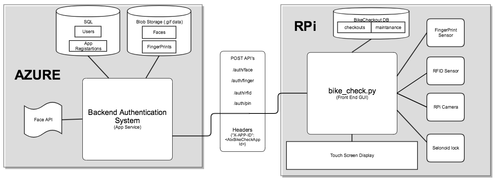
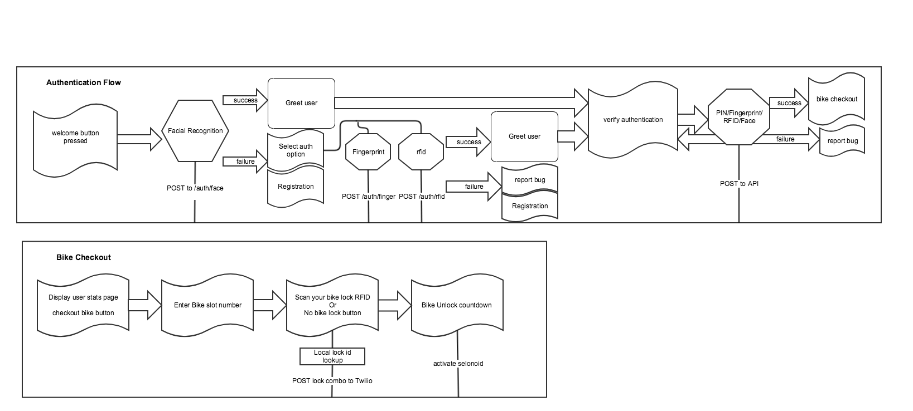

##### Bike Check
Internal Hackathon project for Recording bike status and usage through a mfa service focusing on biometrics.

Built with a Raspberry pi and the Microsoft Azure platform


#### Architecture overview



#### User Flows



####Docs/Tutorials

## Azure Cognitive Services
https://docs.microsoft.com/en-us/azure/cognitive-services/

## Azure Face API
https://southcentralus.dev.cognitive.microsoft.com/docs/services/563879b61984550e40cbbe8d/operations/563879b61984550f30395239

## Arduino fingerprint sensor guide
https://learn.adafruit.com/remote-controlled-door-lock-using-a-fingerprint-sensor-and-adafruit-io/

## Python + OpenCV facial recognition
https://www.pyimagesearch.com/2018/06/18/face-recognition-with-opencv-python-and-deep-learning/

## Sentdex - opencv Facial detection & identification
https://www.youtube.com/watch?v=88HdqNDQsEk

## RFID detection
https://pimylifeup.com/raspberry-pi-rfid-rc522/

## RPi Auto start program
https://www.dexterindustries.com/howto/run-a-program-on-your-raspberry-pi-at-startup/

## Basic Face detection code snippet
```
## detects faces from camera using haarcascade classifications
import cv2
import sys

cascPath = sys.argv[1]
#cascPath = 'haarcascade_frontalface_default.xml'
faceCascade = cv2.CascadeClassifier(cascPath)

video_capture = cv2.VideoCapture(0)

while True:
    # Capture frame-by-frame
    ret, frame = video_capture.read()

    gray = cv2.cvtColor(frame, cv2.COLOR_BGR2GRAY)

    faces = faceCascade.detectMultiScale(
        gray,
        scaleFactor=1.1,
        minNeighbors=5,
        minSize=(30, 30),
        flags=cv2.CASCADE_SCALE_IMAGE
    )

    # Draw a rectangle around the faces
    for (x, y, w, h) in faces:
        cv2.rectangle(frame, (x, y), (x+w, y+h), (0, 255, 0), 2)
        crop_img = frame[y:y+h, x:x+w]
        cv2.imshow("cropped", crop_img)

    # Display the resulting frame
    cv2.imshow('Video', frame)

    if cv2.waitKey(1) & 0xFF == ord('q'):
        break

# When everything is done, release the capture
video_capture.release()
cv2.destroyAllWindows()
```
